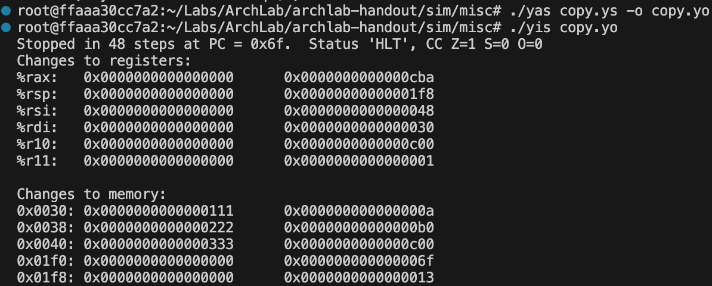
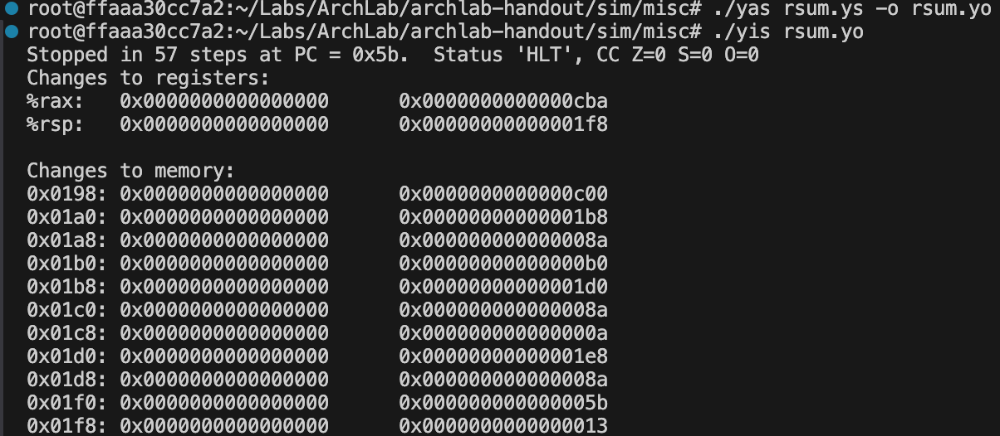
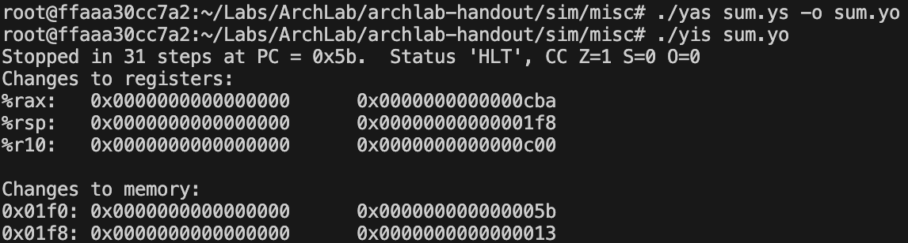
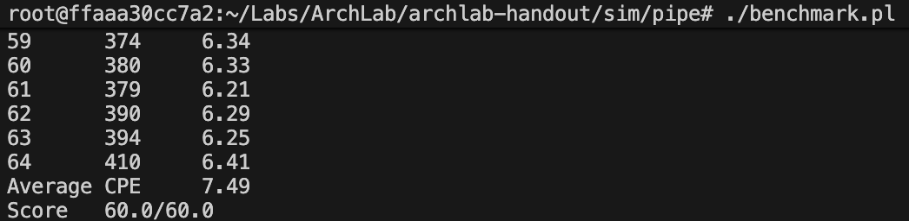

# **ArchLab**

## PartA

### Part1: sum

``` c
long sum_list(list_ptr ls)
{
    long val = 0;
    while (ls) {
	val += ls->val;
	ls = ls->next;
    }
    return val;
}
```

- **初始化累加和**：用`xorq %rax, %rax`将返回值寄存器`%rax`初始化为 0。
- **循环控制**：
  - 循环条件判断：通过`andq %rdi, %rdi`检查链表指针`ls`是否为`NULL`（若`%rdi`为 0 则跳转至`loop_end`）。
  - 累加当前元素值：用`mrmovq (%rdi), %r10`读取`ls->val`（`%rdi`指向当前节点，首 8 字节为`val`），再通过`addq %r10, %rax`累加至`%rax`。
  - 更新链表指针：用`mrmovq 8(%rdi), %rdi`将`ls`指向`ls->next`（节点的第二个 8 字节为`next`指针），随后跳转回循环开头继续遍历。
- **函数结语**：通过`rrmovq %rbp, %rsp`和`popq %rbp`恢复栈帧，最后用`ret`返回，此时`%rax`中存储累加和。
- 采用作业中数据示例，使用yas和yis编译后最终可以获得以下输出：



### Part2: rsum

``` c
long rsum_list(list_ptr ls)
{
    if (!ls)
	return 0;
    else {
	long val = ls->val;
	long rest = rsum_list(ls->next);
	return val + rest;
    }
}
```

- **基准情况处理**：通过`andq %rdi, %rdi`判断链表指针是否为空，为空则用`xorq %rax, %rax`返回 0
- **递归准备**：用`mrmovq (%rdi), %r10`保存当前节点值（`ls->val`）并用`mrmovq 8(%rdi), %rdi`更新参数为下一个节点（`ls->next`）
- **递归计算**：调用`rsum_list`后，通过`addq %r10, %rax`累加当前节点值与递归结果
- **栈帧管理**因递归需要保存中间结果，通过`pushq %r10`保存当前节点值（被调用者保存寄存器），函数返回前`popq %r10`恢复，确保递归链中数据正确传递。
- 采用作业中数据示例，使用yas和yis编译后最终可以获得以下输出：



### Part3: copy

``` c
long copy_block(long *src, long *dest, long len)
{
    long result = 0;
    while (len > 0) {
	long val = *src++;
	*dest++ = val;
	result ^= val;
	len--;
    }
    return result;
}
```

- **初始化**：用`xorq %rax, %rax`将异或和`result`初始化为 0
- **循环控制**：通过`andq %rdx, %rdx`判断`len`是否为 0，为 0 则跳转至循环结束
- **数据操作**：用`mrmovq (%rdi), %r10`读取`src`当前值，用`rrmovq %r10, (%rsi)`写入`dest`并用`xorq %r10, %rax`更新异或和
- **数据更新**：通过`addq $8, %rdi`和`addq $8, %rsi`将指针递增并使用`subq $1, %rdx`将长度递减
- 临时变量使用`%r10`、`%r11`（调用者保存寄存器），避免修改被调用者保存寄存器
- 采用作业中数据示例，使用yas和yis编译后最终可以获得以下输出：



## PartB

### `iaddq` 指令的执行阶段规划

1. **Fetch（取指阶段）**
   - 从内存读取指令：`icode:ifun`取自`M1[PC]`，`rA:rB`取自`M1[PC+1]`，立即数`V`（valC）取自`M8[PC+2]`
   - 计算下一条指令地址：`valP = PC + 10`（指令长度为 10 字节：1 字节操作码 + 1 字节寄存器字段 + 8 字节立即数）
2. **Decode（译码阶段）**
   - 从寄存器文件读取 rB 的值：`valB = R[rB]`（无需读取 rA，因指令无 rA 操作数）
3. **Execute（执行阶段）**
   - 计算结果：`valE = valB + valC`（ALU 执行加法操作）
   - 更新条件码：根据运算结果设置 ZF、SF、OF
4. **Memory（内存阶段）**
   - 无内存访问操作（不需要读写内存）
5. **Write Back（写回阶段）**
   - 将运算结果写回寄存器 rB：`R[rB] = valE`
6. **PC Update（PC 更新阶段）**
   - 按顺序执行：`PC = valP`

### 在 SEQ 处理器中的整合实现

通过在各阶段控制信号中添加 iaddq 的适配逻辑，将其整合到 SEQ 的控制流中，关键修改如下：

- 指令有效性判断：在`instr_valid`集合中加入`IIADDQ`，确认 iaddq 为合法指令
- 资源需求：指令包含寄存器字段 rB 和 8 字节立即数 V，将 `IIADDQ` 加入 `need_regids` 和 `need_valC` 集合
- 源寄存器选择：从 rB 读取操作数，对应`valB` 即 `srcB = rB`
- 目的寄存器选择：运算结果通过 ALU 通路写回 rB即 `dstE = rB`，而 `dstM` 无需写回
- ALU 输入：将立即数 V 作为 ALU 输入 A 即 `aluA = valC` 且寄存器 rB 的值作为 ALU 输入 B 即`aluB = valB`
- ALU 功能：固定执行默认的加法操作 `alufun = ALUADD`
- 条件码更新：加入`IIADDQ`到`set_cc`的判断集合，确保更新条件码
- 无内存操作：`mem_read = 0`且`mem_write = 0`，`mem_addr`和`mem_data`无需适配
- 顺序执行：沿用默认逻辑`new_pc = valP`，无需额外修改

## PartC

### 完善PIPE流水线逻辑

- 将`iaddq`命令加入到PIPE的流水线实现中，其指令阶段划分与PartB一致，这里不再赘述，具体需要修改以下几部分（与PartB类似）：

```verilog
bool instr_valid = f_icode in 
	{ INOP, IHALT, IRRMOVQ, IIRMOVQ, IRMMOVQ, IMRMOVQ,
	  IOPQ, IJXX, ICALL, IRET, IPUSHQ, IPOPQ, IIADDQ };

bool need_regids =
	f_icode in { IRRMOVQ, IOPQ, IPUSHQ, IPOPQ, 
		     IIRMOVQ, IRMMOVQ, IMRMOVQ, IIADDQ };

bool need_valC =
	f_icode in { IIRMOVQ, IRMMOVQ, IMRMOVQ, IJXX, ICALL, IIADDQ };

word d_srcB = [
	D_icode in { IOPQ, IRMMOVQ, IMRMOVQ, IIADDQ } : D_rB;
	D_icode in { IPUSHQ, IPOPQ, ICALL, IRET } : RRSP;
	1 : RNONE;  // Don't need register
];

word d_dstE = [
	D_icode in { IRRMOVQ, IIRMOVQ, IOPQ, IIADDQ } : D_rB;
	D_icode in { IPUSHQ, IPOPQ, ICALL, IRET } : RRSP;
	1 : RNONE;  // Don't write any register
];

word aluA = [
	E_icode in { IRRMOVQ, IOPQ } : E_valA;
	E_icode in { IIRMOVQ, IRMMOVQ, IMRMOVQ, IIADDQ } : E_valC;
	E_icode in { ICALL, IPUSHQ } : -8;
	E_icode in { IRET, IPOPQ } : 8;
	// Other instructions don't need ALU
];

word aluB = [
	E_icode in { IRMMOVQ, IMRMOVQ, IOPQ, ICALL, 
		     IPUSHQ, IRET, IPOPQ, IIADDQ } : E_valB;
	E_icode in { IRRMOVQ, IIRMOVQ } : 0;
	// Other instructions don't need ALU
];

bool set_cc = (E_icode in { IOPQ, IIADDQ } )&&
	// State changes only during normal operation
	!m_stat in { SADR, SINS, SHLT } && !W_stat in { SADR, SINS, SHLT };
```

### 修改`ncopy`具体实现

```asm
# 原始代码内容如下所示：
	xorq %rax,%rax		# count = 0;
	andq %rdx,%rdx		# len <= 0?
	jle Done		# if so, goto Done:
Loop:	
	mrmovq (%rdi), %r10	# read val from src...
	rmmovq %r10, (%rsi)	# ...and store it to dst
	andq %r10, %r10		# val <= 0?
	jle Npos		# if so, goto Npos:
	irmovq $1, %r10
	addq %r10, %rax		# count++
Npos:	
	irmovq $1, %r10
	subq %r10, %rdx		# len--
	irmovq $8, %r10
	addq %r10, %rdi		# src++
	addq %r10, %rsi		# dst++
	andq %rdx,%rdx		# len > 0?
	jg Loop			# if so, goto Loop:
```

- 我们可以观察到原始代码存在以下缺陷：

  - **循环开销过大，执行效率低**：原始代码采用单轮循环结构，每次循环仅处理 1 个数据元素，却需要执行完整的 “读取 - 存储 - 判断 - 计数 - 地址更新 - 循环条件检查” 流程；每次循环都必须重复执行`andq %rdx,%rdx`（循环条件检查）和`jg Loop`（分支跳转），分支跳转带来的流水线清空开销会随循环次数累积，导致整体执行效率低下。
  - **地址计算存在冗余**：原始代码中每次循环都通过`irmovq $8, %r10`加载固定偏移量，再通过`addq %r10, %rdi`和`addq %r10, %rsi`更新源地址和目的地址，属于冗余操作，增加了指令执行次数和寄存器占用。
  
- 因此我们基于原始代码，首先进行**循环展开**的优化，这里采用 “10 级循环展开” 策略，将原始的 “单次处理 1 个元素” 优化为 “单次处理 10 个元素”：

  - 循环条件预处理：通过`iaddq $-10,%rdx`判断剩余元素数量是否≥10，若满足则进入展开后的大循环（Loop1~Loop10），否则进入剩余元素的处理分支（Root 及后续 Remain1~Remain9）；
  - 批量处理数据：在 Loop1~Loop10 中，通过连续的`mrmovq`指令批量读取源地址（`rdi`）偏移 0、8、16、…、72 字节的 10 个数据（利用`r10`、`r11`寄存器交替存储），再通过连续的`rmmovq`指令将数据批量存储到目的地址（`rsi`）对应偏移位置；
  - 并行计数与分支优化：对每个读取的数据，通过`andq`判断正负，满足 `val>0` 则执行`iaddq $0x1, %rax`计数，分支跳转（`jle`）仅在当前数据非正时跳过计数，避免了原始代码中 “每个元素独立循环” 的重复跳转；
  - 批量更新地址与循环条件：处理完 10 个元素后，通过`iaddq $80, %rdi`和`iaddq $0x50, %rsi`批量更新地址，再通过`iaddq $-10,%rdx`更新剩余长度，若仍≥10 则重复大循环。

- 其次对于10级循环展开的余数场景，针对剩余元素数量（len%10）的不同情况（1~9 个），新代码通过 Root 分支将剩余长度分类，分别进入 Remain1~Remain9 处理：

  - 长度判断优化：通过`iaddq`调整`rdx`（剩余长度）的值，结合`jl`/`jg`/`je`分支跳转，快速定位剩余元素数量；
  - 针对性数据处理：每个 Remain 分支仅处理对应数量的剩余元素，通过`mrmovq`（读取）、`rmmovq`（存储）、`andq`（判断）、`iaddq`（计数）指令完成逻辑，避免冗余操作。

- 在优化代码的过程中，会碰到**载入-使用冒险**，即`mrmovq`（载入数据）与`rmmovq`（使用载入的数据存储）、`andq`（使用载入的数据判断）紧邻的情形；通过`r10`和`r11`寄存器交替存储载入的数据，避免连续依赖同一寄存器。例如：

  ``` asm
  mrmovq (%rdi), %r10        # 载入数据到r10
  mrmovq 8(%rdi), %r11       # 载入下一个数据到r11（不依赖r10）
  rmmovq %r10, (%rsi)        # 使用r10存储（此时r10已完成载入）
  andq %r10, %r10            # 使用r10判断（无冒险）
  ```

- 最终平均**CPE=7.49**，满足要求


